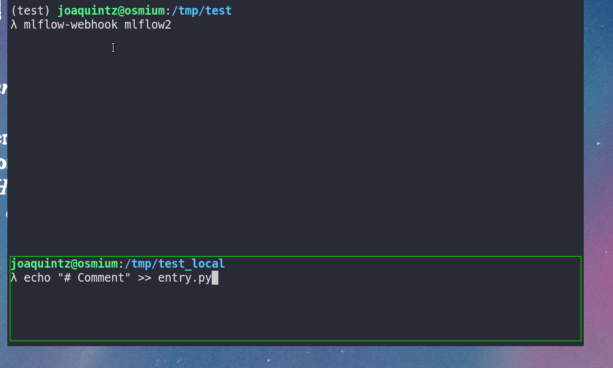

## mlflow-python-webhook

Runs a server that responds to GitHub webhooks on a given branch by running
the updated MLflow pipelines/entrypoints. The package accomplishes this by:

* serving a FastAPI instance and processing received webhooks
* finding which pipelines have changed (by scanning the `MLproject` file,
the entrypoints and *their dependencies*)
* running mlflow only on the changed pipelines.



Effectively, this means that if your MLproject looks something like this:

```yaml
# ...
entry_points:
  main:
    command: "python entrypoint_main.py"
  other:
    command: "python entrypoint_other.py"
```

and a recent pushed commit modifies only the file `model.py`, which is
imported by `entrypoint_main.py`, only the `main` pipeline is launched.


## Running

After installing the package, go to the folder that contains your
git repo and run the following:

```
mlflow-webhook <branch>
```

to run the changed pipelines when the given branch receives an
update.

For this to work, you must first enable webhooks in your repository.
To do this, go to your GitHub page > Settings > Webhooks > Add webhook.
Specify the content as `application/json`, specify a secret if you want,
copy the payload URL and subscribe only to `push` events. Don't forget
to set it as Active.

Complete usage is as follows (see `mlflow-webhook --help` for details):

```
mlflow-webhook [-h] [--debug] [--ip IP] [--port PORT] [--secret SECRET] [--repo REPO] branch
```